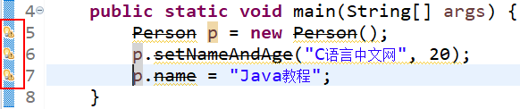
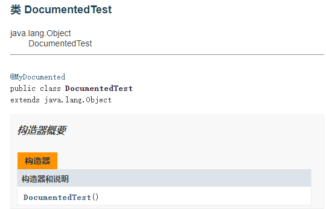

# 注解

## 简介

从 Java 5 版本之后可以在源代码中嵌入一些补充信息，这种补充信息称为注解（Annotation），是 Java 平台中非常重要的一部分。注解都是 **@ 符号开头的** 如@Override 注解，同 Class 和 Interface 一样，**注解也属于一种类型。**

注解并**不能改变程序的运行结果，**也**不会影响程序运行的性能**，注解可以在编译时给用户提示或警告，在运行时读写字节码文件信息。

注解常见的作用有以下几种：

1. 生成帮助文档。这是最常见的，也是 Java 最早提供的注解。常用的有 @see、@param 和 @return 等；
2. 跟踪代码依赖性，实现替代配置文件功能。比较常见的是 [Spring](http://c.biancheng.net/spring/) 2.5 开始的基于注解配置。作用就是减少配置。现在的框架基本都使用了这种配置来减少配置文件的数量；
3. 在编译时进行格式检查。如把 @Override 注解放在方法前，如果这个方法并不是重写了父类方法，则编译时就能检查出。

无论是哪一种注解，本质上都一种数据类型，是**一种接口类型**。到 Java 8 为止 Java SE 提供了 11 个内置注解。其中有 5 个是基本注解，它们来自于 java.lang 包。有 6 个是元注解，它们来自于 java.lang.annotation 包，自定义注解会用到元注解。

>  提示：元注解就是负责注解其他的注解。

基本注解包括：@Override、@Deprecated、@SuppressWarnings、@SafeVarargs 和 @FunctionalInterface。

## 基本注解

### @Override【方法重写】

**作用；**

指定方法重写的，只能修饰方法并且只能用于方法重写，不能修饰其它的元素。它可以强制一个子类必须重写父类方法或者实现接口的方法。

```java
public class Person {
    private String name = "";
    private int age;
    ...
    @Override
    public String t0String() { //toString()
        return "Person [name=" + name + ", age=" + age + "]";
    }
}
```

上述代码第 6 行是重写 Object 类的 toString() 方法，该方法使用 @Override 注解。如果 toString() 不小心写成了 t0String()，那么程序会发生编译错误。会有如下的代码提示：

类型为 Person 的方法t0String()必须覆盖或实现超类型方法

当然如果代码中的方法前面不加 @Override 注解，即便是方法编辑错误了，编译器也不会有提示。这时 Object 父类的 toString() 方法并没有被重写，将会引起程序出现 Bug（缺陷）。

### @Deprecated【标记过时】

**作用；**

用来注解类、接口、成员方法和成员变量等，用于表示某个元素（类、方法等）已过时。当其他程序使用已过时的元素时，编译器将会给出警告。

```java
@Deprecated
public class Person {
    @Deprecated
    protected String name;
    private int age;
    public String getName() {
        return name;
    }
    public void setName(String name) {
        this.name = name;
    }
    public int getAge() {
        return age;
    }
    public void setAge(int age) {
        this.age = age;
    }
    @Deprecated
    public void setNameAndAge(String name, int age) {
        this.name = name;
        this.age = age;
    }
    @Override
    public String toString() {
        return "Person [name=" + name + ", age=" + age + "]";
    }
}
```

上述代码第 2 行类 Person、第 4 行的成员变量 name 和第 24 行的 setNameAndAge 方法都被 @Deprecated 注解。在 Eclipse 中这些被注解的 API 都会被画上删除线。调用这些 API 代码也会有删除线，示例代码如下。 


Java 9 为 @Deprecated 注解增加了以下两个属性：

- forRemoval：该 boolean 类型的属性指定该 API 在将来是否会被删除。
- since：该 String 类型的属性指定该 API 从哪个版本被标记为过时。

````java
class Test {
    // since属性指定从哪个版本开始被标记成过时，forRemoval指定该API将来会被删除
    @Deprecated(since = "9", forRemoval = true)
    public void print() {
        System.out.println("这里是C语言中文网Java教程！");
    }
}
public class DeprecatedTest {
    public static void main(String[] args) {
        // 下面使用info()方法时将会被编译器警告
        new Test().print();
    }
}
````

上面程序的第 12 行代码使用了 Test 的 print() 方法，而 Test 类中定义 info() 方法时使用了 @Deprecated 修饰，表明该方法已过时，所以将会引起编译器警告。

@Deprecated 的作用与文档注释中的 @deprecated 标记的作用基本相同，但它们的用法不同，前者是 Java 5 才支持的注解，无须放在文档注释语法（/** ... */部分）中，而是直接用于修饰程序中的程序单元，如方法、类和接口等。

### @SuppressWarnings【抑制编译器警告】

**作用；**

指示被该注解修饰的程序元素（以及该程序元素中的所有子元素）取消显示指定的编译器警告，且会一直作用于该程序元素的**所有子元素**。

例如，使用 @SuppressWarnings 修饰某个类取消显示某个编译器警告，同时又修饰该类里的某个方法取消显示另一个编译器警告，那么该方法将会**同时取消显示这两个编译器警告。**

@SuppressWarnings 注解主要用在取消一些编译器产生的警告对代码左侧行列的遮挡，有时候这样会挡住我们断点调试时打的断点。如下图所示。




**注解的使用有以下三种：**

1. 抑制单类型的警告：`@SuppressWarnings("unchecked")`
2. 抑制多类型的警告：`@SuppressWarnings("unchecked","rawtypes")`
3. 抑制所有类型的警告：`@SuppressWarnings("unchecked")`

抑制警告的关键字

| 关键字                   | 用途                                                   |
| ------------------------ | ------------------------------------------------------ |
| all                      | 抑制所有警告                                           |
| boxing                   | 抑制装箱、拆箱操作时候的警告                           |
| cast                     | 抑制映射相关的警告                                     |
| dep-ann                  | 抑制启用注释的警告                                     |
| deprecation              | 抑制过期方法警告                                       |
| fallthrough              | 抑制在 switch 中缺失 breaks 的警告                     |
| finally                  | 抑制 finally 模块没有返回的警告                        |
| hiding                   | 抑制相对于隐藏变量的局部变量的警告                     |
| incomplete-switch        | 忽略不完整的 switch 语句                               |
| nls                      | 忽略非 nls 格式的字符                                  |
| null                     | 忽略对 null 的操作                                     |
| rawtypes                 | 使用 generics 时忽略没有指定相应的类型                 |
| restriction              | 抑制禁止使用劝阻或禁止引用的警告                       |
| serial                   | 忽略在 serializable 类中没有声明 serialVersionUID 变量 |
| static-access            | 抑制不正确的静态访问方式警告                           |
| synthetic-access         | 抑制子类没有按最优方法访问内部类的警告                 |
| unchecked                | 抑制没有进行类型检查操作的警告                         |
| unqualified-field-access | 抑制没有权限访问的域的警告                             |
| unused                   | 抑制没被使用过的代码的警告                             |

```java
public class HelloWorld {
    @SuppressWarnings({ "deprecation" })
    public static void main(String[] args) {
        Person p = new Person();
        p.setNameAndAge("C语言中文网", 20);
        p.name = "Java教程";
    }
}
```


上述代码第 2 行使用 @SuppressWarnings({ "deprecation" }) 注解了 main 方法。在《[Java @Deprecated注解](http://c.biancheng.net/view/6995.html)》一节中的 Person 代码中，这些 API 已经过时了，所以代码第 4 行~第 6 行是编译警告，但是在使用了 @SuppressWarnings 注解之后会发现程序代码的警告没有了。

### @SafeVarargs【压制未检测】

**作用；**

压制unchecked警告

```java
public class HelloWorld {
    public static void main(String[] args) {
        // 传递可变参数，参数是泛型集合
        display(10, 20, 30);
        // 传递可变参数，参数是非泛型集合
        display("10", 20, 30); // 会有编译警告
    }

    public static <T> void display(T... array) {
        for (T arg : array) {
            System.out.println(arg.getClass().getName() + ":" + arg);
        }
    }
}
```

上述代码在可变参数 display 前添加了 @SafeVarargs 注解，当然也可以使用 @SuppressWarnings("unchecked") 注解，但是两者相比较来说 @SafeVarargs 注解更适合。

> 注意：@SafeVarargs注解不适用于**非 static 或非 final 声明的方法**，对于未声明为 static 或 final 的方法，如果要抑制 unchecked 警告，可以使用 @SuppressWarnings 注解。

### @FunctionalInterface 【函数式接口】

**作用；**

> 在学习 Lambda 表达式时，我们提到如果接口中只有一个抽象方法（可以包含多个默认方法或多个 static 方法），那么该接口就是函数式接口。

指定某个接口必须是函数式接口，所以 @FunInterface **只能修饰接口**，不能修饰其它程序元素。

例如，如下程序使用 @FunctionalInterface 修饰了函数式接口。

```java
@FunctionalInterface
public interface FunInterface {
    static void print() {
        System.out.println("C语言中文网");
    }
    default void show() {
        System.out.println("我正在学习C语言中文网Java教程");
    }
    void test(); // 只定义一个抽象方法
}
```

编译上面程序，可能丝毫看不出程序中的 @FunctionalInterface 有何作用，因为 @FunctionalInterface 注解的作用只是告诉编译器检查这个接口，**保证该接口只能包含一个抽象方法**，否则就会编译出错。

@FunctionalInterface 注解主要是帮助程序员避免一些低级错误，例如，在上面的 FunInterface 接口中再增加一个抽象方法 abc()，编译程序时将出现如下错误提示：

```
“@FunctionInterface”批注无效；FunInterface不是functional接口
```


## 元注解

元注解是负责**对其它注解进行说明的注解**，自定义注解时可以使用元注解。Java 5 定义了 4 个注解，分别是 @Documented、@Target、@Retention 和 @Inherited。Java 8 又增加了 @Repeatable 和 @Native 两个注解。这些注解都可以在 java.lang.annotation 包中找到。

### @Documented【标记】

@Documented **没有成员变量**。用 @Documented 注解**修饰的注解类会被 JavaDoc 工具提取成文档。**默认情况下，JavaDoc 是不包括注解的，但如果声明注解时指定了 @Documented，就会被 JavaDoc 之类的工具处理，所以注解类型信息就会被包括在生成的帮助文档中。

```java
@Documented
@Target({ ElementType.TYPE, ElementType.METHOD })
public @interface MyDocumented {
    public String value() default "这是@Documented注解";
}
```

测试类：

```java
@MyDocumented
public class DocumentedTest {
    /**
     * 测试document
     */
    @MyDocumented
    public String Test() {
        return "C语言中文网Java教程";
    }
}
```

打开 Java 文件所在的目录，分别输入如下两条命令行：

```java
javac MyDocumented.java DocumentedTest.java
javadoc -d doc MyDocumented.java DocumentedTest.java
```

可以看到在类和方法上都保留了 MyDocument 的注解信息。如下图所示：




### @Target【适用范围】

@Target 注解用来指定一个注解的使用范围，即**被 @Target 修饰的注解可以用在什么地方**。@Target 注解有一个成员变量（value）**用来设置适用目标**，value 是 java.lang.annotation.**ElementType 枚举类型的数组**，下表为 ElementType 常用的枚举常量

| 名称           | 说明                                     |
| -------------- | ---------------------------------------- |
| CONSTRUCTOR    | 用于构造方法                             |
| FIELD          | 用于成员变量（包括枚举常量）             |
| LOCAL_VARIABLE | 用于局部变量                             |
| METHOD         | 用于方法                                 |
| PACKAGE        | 用于包                                   |
| PARAMETER      | 用于类型参数（JDK 1.8新增）              |
| TYPE           | 用于类、接口（包括注解类型）或 enum 声明 |

如自定义一个 MyTarget 注解，使用范围为方法

```java
@Target({ ElementType.METHOD })
public @interface MyTarget {
}
class Test {
    @MyTarget
    String name;
}
```

如上代码第 6 行会编译错误，错误信息为：

```
The annotation @MyTarget is disallowed for this location
```

提示此位置不允许使用注解 @MyDocumented，@MyTarget 不能修饰成员变量，只能修饰方法。

### @Retention【生命周期】

@Retention 用于**描述注解的生命周期**，也就是该**注解被保留的时间长短**。@Retention 注解中的成员变量（value）用来设置保留策略，value 是 java.lang.annotation.**RetentionPolicy 枚举类型**，RetentionPolicy 有 3 个枚举常量，

1. SOURCE：在源文件中有效（即源文件保留）

2. CLASS：在 class 文件中有效（即 class 保留）

3. RUNTIME：在运行时有效（即运行时保留）

生命周期大小排序为 SOURCE < CLASS < RUNTIME，**前者能使用的地方后者一定也能使用**。

如果需要在运行时去动态获取注解信息，那只能用 RUNTIME 注解；如果要在编译时进行一些预处理操作，比如生成一些辅助代码（如 ButterKnife），就用 CLASS 注解；如果只是做一些检查性的操作，比如 @Override 和 @SuppressWarnings，则可选用 SOURCE 注解。

### @Inherited 【可以被继承】

@Inherited 是一个标记注解，用来指定该注解**可以被继承**。使用 @Inherited 注解的 Class 类，表示这个注解可以被用于该 Class 类的子类。就是说如果某个类使用了被 @Inherited 修饰的注解，则其子类将自动具有该注解。

```java
@Target({ ElementType.TYPE })
@Inherited
@Retention(RetentionPolicy.RUNTIME)
public @interface MyInherited {
}
```

测试类代码如下：

```java
@MyInherited
public class TestA {
    public static void main(String[] args) {
        // getAnnotation() 获取注解
        System.out.println(TestA.class.getAnnotation(MyInherited.class));
        System.out.println(TestB.class.getAnnotation(MyInherited.class));
        System.out.println(TestC.class.getAnnotation(MyInherited.class));
    }
}
class TestB extends TestA {
}
class TestC extends TestB {
}
```

运行结果为：

```
@MyInherited()
@MyInherited()
@MyInherited()
```

### @Repeatable【重复注解】

@Repeatable 注解是 Java 8 新增加的，它允许在相同的程序元素中重复注解，在**需要对同一种注解多次使用**时，往往需要借助 @Repeatable 注解。Java 8 版本以前，同一个程序元素前最多只能有一个相同类型的注解，如果需要在同一个元素前使用多个相同类型的注解，则必须使用注解“容器”。

Java 8 之前的做法：

```java
public @interface Roles {
    Role[] roles();
}
public @interface Roles {
    Role[] value();
}
public class RoleTest {
    @Roles(roles = {@Role(roleName = "role1"), @Role(roleName = "role2")})
    public String doString(){
        return "这是C语言中国网Java教程";
    }
}
```

Java 8 之后增加了重复注解，

```java
public @interface Roles {
    Role[] value();
}
@Repeatable(Roles.class)
public @interface Role {
    String roleName();
}
public class RoleTest {
    @Role(roleName = "role1")
    @Role(roleName = "role2")
    public String doString(){
        return "这是C语言中文网Java教程";
    }
}
```


不同的地方是，创建重复注解 Role 时加上了 @Repeatable 注解，指向存储注解 Roles，这样在使用时就可以直接重复使用 Role 注解。从上面例子看出，使用 @Repeatable 注解更符合常规思维，可读性强一点。

两种方法获得的效果相同。重复注解只是一种简化写法，这种简化写法是一种假象，多个重复注解其实会被作为“容器”注解的 value 成员的数组元素处理。


### @Native 【可以被引用】

使用 @Native 注解修饰成员变量，则表示这个**变量可以被本地代码引用**，常常被代码生成工具使用。对于 @Native 注解不常使用，了解即可。


## 自定义注解

定义注解其实和定义接口差多不，只需要在interface前添加一个@符号就可以，即 @interface Zhujie{ }，这就表明我们定义了一个名为 @Zhujie 的注解。

注解中的方法即为注解的元素，元素中不能包含参数，返回值只能为简单数据类型、String、Class、emnus、注释 和这些类型的数组

```java
//自定义注解 @Zhujie ，该注解有两个元素 personId、company
public @interface Zhujie(){
    int personId(); //元素1
    String company() default "[unassigned]"; //元素2
}
```

注解是一种特殊的修饰符，在其他修饰符（例如，public、static 或者 final 等）使用地方都可以使用注解。按照惯例，注解应该**放在其他修饰符的前面**。注解的声明用**@符号后面跟上这个注解类型的名字**，再后面加上括号，括号中列出这个注释中元素的key－value对，其中,元素名为key ，值必须是常量。例如：

```java
@Zhujie(personId=20151120,company="YeePay")
```

如果注解中只有一个元素且元素名字为 value，那么在使用这个注解的时候，元素的名字和等号都可以省略，例如：

```java
public @interface Zhujie(){
    String value();
}
//使用方式

@Zhujie(value="hello")
或
@Zhujie("hello")
```

注解前面的访问修饰符和类一样有两种，分别是公有访问权限（public）和默认访问权限（默认不写）。**一个源程序文件中可以声明多个注解**，但只能有**一个是公有访问权限的注解**。且源**程序文件命名和公有访问权限的注解名一致**。

### 标记注解

不包含任何成员变量的注解称为标记注解

```java
// 定义一个简单的注解类型
public @interface Test {
}
```

例如上面声明的 Test 注解以及基本注解中的 @Override 注解都属于标记注解。根据需要，注解中可以定义成员变量，成员变量以无形参的方法形式来声明，其方法名和返回值定义了该成员变量的名字和类型。代码如下所示：

```java
public @interface MyTag {
    // 定义带两个成员变量的注解
    // 注解中的成员变量以方法的形式来定义
    String name();
    int age();
}
```

以上代码中声明了一个 MyTag 注解，定义了两个成员变量，分别是 name 和 age。成员变量也可以有访问权限修饰符，但是**只能有公有权限和默认权限**。

如果在注解里定义了成员变量，那么使用该注解时就应该为它的成员变量指定值，

```java
public class Test {
    // 使用带成员变量的注解时，需要为成员变量赋值
    @MyTag(name="xx", age=6)
    public void info() {
        ...
    }
    ...
}
```

注解中的成员变量也可以有默认值，可使用 default 关键字

```java
public @interface MyTag {
    // 定义了两个成员变量的注解
    // 使用default为两个成员变量指定初始值
    String name() default "C语言中文网";
    int age() default 7;
}
```

如果为注解的成员变量指定了默认值，那么使用该注解时就可以不为这些成员变量赋值，而是直接使用默认值。

```java
public class Test {
    // 使用带成员变量的注解
    // MyTag注释的成员变量有默认值，所以可以不为它的成员变量赋值
    @MyTag
    public void info() {
        ...
    }
    ...
}
```

如果为 MyTag 的成员变量指定了值，则默认值不会起作用。

根据注解是否包含成员变量，可以分为如下两类。

1. 标记注解：没有定义成员变量的注解类型被称为标记注解。这种注解仅利用自身的存在与否来提供信息，如前面介绍的 @Override、@Test 等都是标记注解。
2. 元数据注解：包含成员变量的注解，因为它们可以接受更多的元数据，所以也被称为元数据注解。


