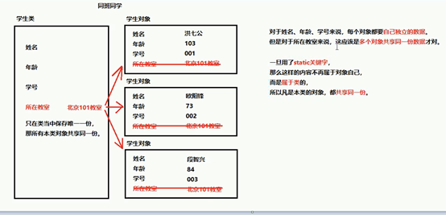
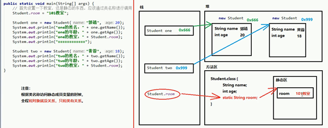

# static

## 修饰成员变量



用static 修饰的成员属性不在属于对象，而是属于整个类变为公共量。多个对象之间会公用一个属性及共用同一个空间。只需要使用一次其它成员也会拥有，也可以结合其它修饰词使用。

## 修饰成员方法

有static关键词的方法叫静态方法。静态方法不属于对象而是属于类的。要使用可以通过对象调用也可以直接使用类名来调用。

`obj.MethodName()` 不推荐使用，编译后也会被翻译为如下

`ClassName.MethodName()`; 推荐使用

没有static关键词的方法叫成员方法，要使用此方法必须创建对象，然后通过对象才能使用。

## 使用规范

无论是成员变量，还是成员方法。如果有了static，都推荐使用类名称进行调用。

- 静态变量：类名称.静态变量
- 静态方法；类名称，静态方法

对于本类中的方法可以省略，类名直接调用方法

## 注意事项

1. 静态不能直接访问**非静态**。
   原因：因为在内存当中是【先】有的静态内容，【后】有的非静态内容。
   “先人不知道后人，但是后人知道先人。”
2. 静态方法当中**不能用this。**
   原因：this代表当前对象，通过谁调用的方法，谁就是当前对象

## 静态内存图



## 静态代码块

 作用；当第一次用到本类时，静态代码块执行唯一的一次。

```java
格式；直接在类中 
    static {    
    //代码块
}
```


