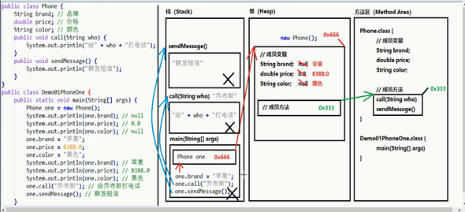
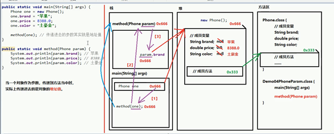
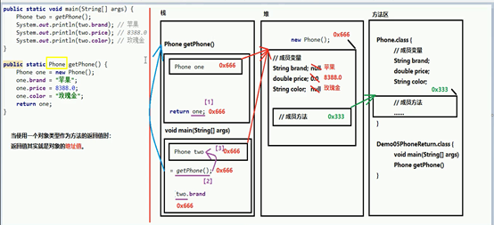

# 类

## 类和对象的关系

对象就是类实例化的表现。比如手机的设计图纸就是一个抽象的类，有图纸做成的手机就是一个实力的对象。

## 定一个类

**注意；**

 在类中属性叫做==成员变量而行为叫做==成员方法

一个类在定义后并不能直接使用。

### 成员属性

 就是一些变量。如int String 等，成员属性都是定义到方法外面的就是类里面，叫做全局变量。

### 成员方法

 `public void method () {}`   定义一个成员方法。

和之前的相比省略了static

**举例定义一个学生类；**

```java
public class Student {
    /*
    * 分析
    * 属性；
    *   姓名
    *   年龄
    *   ……
    * 行为；
    *   睡觉
    *   学习
    *   吃饭
    *   ……
    * */
    //定义成员变量
    String name;
    int arge;
	
    // 定义成员方法
    
    public void sleep() {
        System.out.println("睡觉中");
    }
    public void study() {
        System.out.println("学习中");
    }
    public void eat() {
        System.out.println("吃吃吃");
    }
}

```

## 类实例化为对象

### 导包（引入类文件）

import 包名称.类名称

如

`import top.miku.day24.Student`

**注意；**

 在**同一包**下使用这个类就不需要导包。

### 创建对象

格式；

 类名称 对象名 = new 类名称();

示例；

```java
 Student Demo = new Student();
```


### 使用对象

**成员变量**

格式；

 对象.成员名

示例；

```java
 Demo.name;
```

**成员方法**

格式；

 对象.成员方法（）

示例；

```java
 Demo.name();
```

代码示例（接上面的学生类

```java
package top.miku.day24;//类的所在包
import top.miku.day24.Student;//引入类包
public class Object {
    public static void main(String[] args) {
        Student stu = new Student();//把Studentl类实力化为一个对象。
        //使用其中的成员变量
        System.out.println("年龄"+stu.arge);
        System.out.println("名字"+stu.name);
        //使用其中的成员方法
        stu.sleep();
        stu.study();
        stu.eat();
        //修改成员变量的值
        stu.name = "初音未来";
        stu.arge = 16;
        System.out.println("名字\n"+stu.name+"\n年龄\n"+stu.arge);
    }
}

```

## 运行在内存中示意图

### 类示例化对象



运行程序要进栈（压栈），运行完毕出栈（弹栈）。

### 对象作为方法的参数传递



### 对象作为方法的返回值调用



定义的类，其实是一种引用类型的数据，这里定义了一个phone类，所以我可以使用其来创建phone类型的变量。
