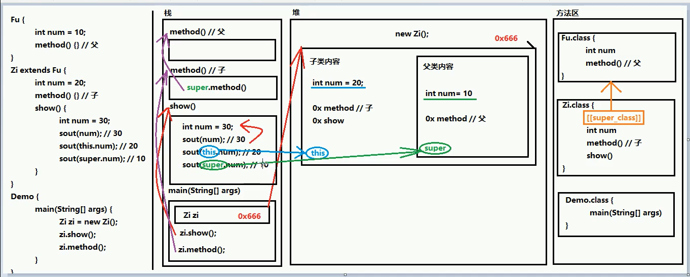

# 继承

**主要特征；**

 

继承是多态的前提，没有继承，就没有多态。

**画图理解；**

 

## 格式

 父类定义；和普通类定义无区别。

 子类定义；`public class Demo extends 要继承的父类名。`

 在继承的关系中，"子类就是一个父类"。也就是说，子类可以被当做父类看待。例如父类是员工，子类是讲师，那么“讲师就是一个员工"。关系：is-a

````java
// 定义父类的格式：（一个普通的类定义）
public class 父类名称{

}
// 定义子类的格式：
public class 子类名称 extends父类名称{

}
````


````java
public classs Demo01Extends {
    public static void main(String[] args){
        //创建了一个子类对象
        Teacher teacher = new Teacher();
        // Teacher类当中虽然什么都没写，但是会继承来自父类的method方法。
        teacher.method();
    }
}
````


## 成员变量的访问

### 成员变量重名时

在父子类的继承关系当中，如果成员变量**重名**，则创建子类对象时，访问有两种方式

- 直接通过子类对象访问成员变量；

  等号左边是谁，就优先用谁，没有则向上找。

- 间接通过成员方法访问成员变量：
	该方法属于谁，就优先用谁，没有则向上找。

**三种变量重名问题；（子类中操作）**

1. 本类的成员变量； this.成员变量

2. 本类方法中的局部变量；直接写成员变量名

3. 父类的成员变量；super.成员变量。

## 成员方法的访问

### 重名后

在父子类的继承关系当中，创建子类对象，访问成员方法的规则：创建的对象是谁，就优先用谁，如果没有则向上找。
**注意事项：**无论是成员方法还是成员变量，如果没有都是向上找父类，绝对不会向下找子类的。

`new` 谁就优先使用其方法。

## 方法的重写

**重写（override）**
概念：在继承关系当中，方法的名称一样，参数列表也一样。
重写（Override）：方法的名称一样，参数列表【也一样】。覆盖、覆写。
重载（overload）：方法的名称一样，参数列表【不一样】。
方法的覆盖重写特点：创建的是子类对象，则优先用子类方法。1

**注意事项；**

1. 必须保证父子类之间方法的名称相同，参数列表也相同。
   `@override，`写在方法前面，用来检测是不是有效的正确覆盖重写。
   这个注解就算不写，只要满足要求，也是正确的方法覆盖重写。

2. 子类方法的返回值必须【小于等于】父类方法的返回值范围。

   小扩展提示，`java.lang.object`类是所有类的公共最高父类（祖宗类）.`java.lang.String`就是object的子类。

3. 子类方法的权限须【大于等于】父类方法的权限修饰符。
   小扩展提示：public > protected >（default）> private备注：（default）不是关键字default，而是什么都不写，留空。


**什么时候覆写呢？**


## 构造方法(子类构造方法内调用父类)

特点；

继承关系中，父子类构造方法的访问特点：

- 子类构造方法当中有一个默认隐含的"`super()`，"周用，所以一定是先调用的父类构造，后执行的子英构造

- 子类构造可以通过super关键字来调用父类重载构造。

- super的父类构造调用，必须是子类构造方法的第一个语句。不能一个子类构造调用多次super构造。

  **总结**
  子类必须调用父类构造方法，不写则赠送super()；写了则用写的指定的super调用，super只能有一个，还必须是第一个。

## super 关键词

作用；

 子类用来访问父类内容。

1. 在子类的成员方法中，访问父类的成员变量。
2. 在子类的成员方法中，访问父类的成员方法。
3. 在子类的构造方法中，访问父类的构造方法。

## this补充

作用；

 this用来访问本类内容。

super关键字用来访问父类内容，而this关键字用来访问本类内容。用法也有三种；

1. 在本类的成员方法中，访问本类的成员变量。

2. 在本类的成员方法中，访问本类的另一个成员方法。

3. 在本类的构造方法中，访问本类的另一个构造方法。

   在第三种用法当中要注意
   `A.this()`调用也必须是构造方法的第一个语句，唯一个。
   B.super和this两种构造调用**不能同时使用。**


## super和this内存图


