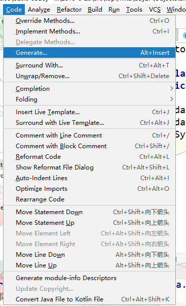

# 面向对象

**特征；**

 三大特征分别是封装、继承,多态。

## 封装

概念；

 把面向过程的代码封装为一个方法，调用者无需关心方法的具体步骤。这种思想就叫做封装。

做法；

1、  方法就是一种封装

2、  修饰符private也是一种封装。

### private

**问题；**

 通常我们定义了一个成员变量，当使用者把其修改为不合理的数据后我们无法对其限制。如年龄 使用者传递负数int型也不会报错的。

**解决；**

 private成员变量修饰就是用来解决以上问题的。他的作用就是让这个成员变量无法在外部直接访问（直接点出来），但是可以间接访问。

示例代码；

```java
 private int arge = 18;//被private修饰后的成员变量只能在成员变量所属的类中直接访问，超出就无法访问。
```


#### 间接访问

从本类中定义set方法和get方法

优点；

 通过间接访问我们可以从方法中定义一些判断语句来限制不合理数据的传递。

##### 修改成员变量值

````java
public void setAge(int num){
    age = num;//把接收到要修改的参数赋值给age。
}
````

1. 方法必须无返回值 。
2. 方法名必须有set关键字后面接着是成员变量名首字母要大写。
3. 参数 类型要和要修改的成员类型一直 。
4. 通过调用这个方法就可以设置其值了。

##### 获取成员变量值

````java
public int getAge() {
  return age;
}

````

1. 返回值类型必须要和要获取的成员变量类型一致
2. 方法名必须要有get关键词接着是要获取的成员变量名，首字母必须要大写。如果是基本数据类型的布尔值关键字get要换为is
3. 无参数
4. 把要获取的成员变量用return语句返回给调用者。
5. 通过调用此方法就可以获取此值了

### this关键字

问题；

当方法的局部变量和类中的成员变量重名时，根据就近原则优先使用局部变量。

解决；

 使用this关键字。

this.成员变量名。

原理；

 this指向被调用者，this要从方法中使用。谁调用this，this里面的地址就是谁。

### 构造方法

专用创建对象

格式；

 public 类名称（参数类型 参数名称）{方法体}。

```java
 public ClassName(参数可选){方法体}
```

注意；

1. 构造方法的名称必须和所在的类名称完全一样，就连大小写也要一样
2. 构造方法不要写返回值类型，连void都不写
3. 构造方法不能return一个具体的返回值
4. 如果没有编写任何构造方法，那么编译器将会**默认赠送一个构造方法**，没有参数、方法体什么事情都不做。
   `public Student（）{}`
5. 一旦编写了至少一个构造方法，那么编译器将**不再赠送**。
6. 构造方法也是可以进行重载的。重载：方法名称相同，参数列表不同。

### 构建标准的类（Java Bean）

#### 标准类组成

1. 所有的成员变量都要使用private修饰
2. 为每一个成员变量编写一对儿Getter/Setter方法
3. ·编写一个无参数的构造方法
4. 编写一个全参数的构造方法

**技巧；**

 使用idm可以快速生成构造方法和set get方法

