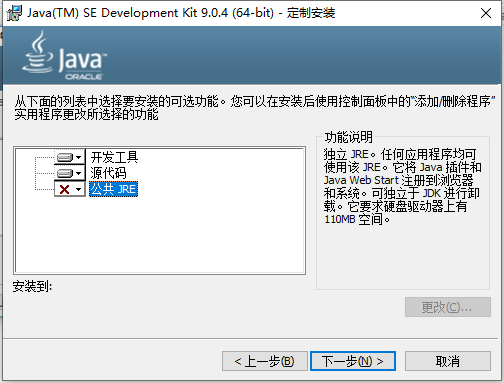
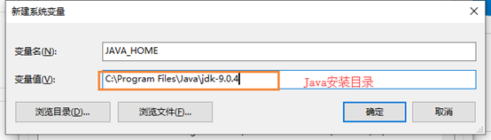

# 搭建开发环境

**须知；**

- JRE是运行Java程序的环境，JRE中包含JVM虚拟机。
- JDK是java程序开发工具包，其中包含JRE和其它环境。
- 在JDK安装路径的bin目录下存放有javac，java源码编译器，java负责运行java程序的程序。

## Windows

### 安装JDK

JDK下载地址；

https://www.oracle.com/technetwork/java/javase/archive-139210.html

​                               

> **提示；**
>
> ​	在【开发工具】中已经包含JRE了所以这里的【公开JRE】可以选择不安装。

### 配置环境变量

1. 新建`JAVA_HOME`变量值Java安装目录。

   

2. 在`path`变量中添加`%JAVA_HOME%\bin`值。

