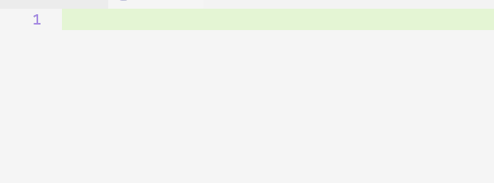

# 编写HelloWorld程序

无论学习什么编程语音，根据国际惯例我们要开发一个Hello World程序作为学习此编程语音的开始。

## 程序开发流程

1. 创建一个以`.java` 为扩展名的文件用来，存放java程序源码。

2.  用`javac` 编译`.java`源码文件，会从当前目录下生成一个同名的`.class`文件。

3. 使用java命令来运行`.class`文件。

## 正式开始

1. 编写源码

   

   **示例代码；**

   ```java
   public class HelloWorld{
   	public static void main(String[] args) {
   		System.out.println("Hello World!");
   	}
   }
   ```

   

2. 编译源码

   ```bash
   javac HelloWorld.java # 编译名为HelloWorld.java文件
   # java [java源码文件名称.java]
   ```

   

3. 运行程序

   ```bash
   java HelloWorld #运行名为HelloWorld的java程序
   # java [要运行的java程序名称]
   ```


## 分析代码含义

- `public class HelloWorld` 定义一个HelloWorld类。
- `public static void main(String[] args)` 定义程序主启动函数。
- `System.out.println("Hello World!");` 往控制台输出一段文本。


