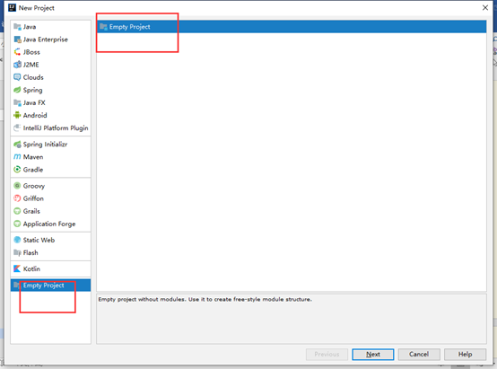
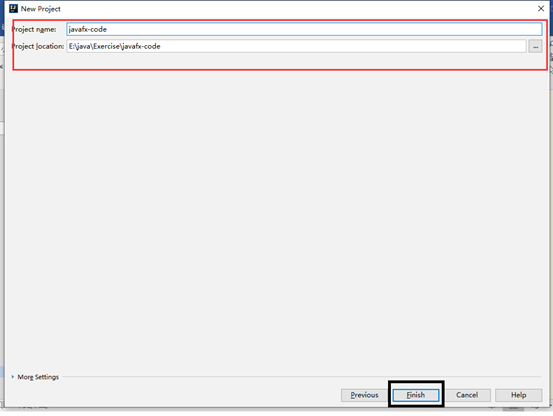
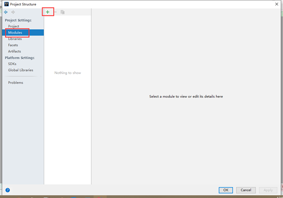
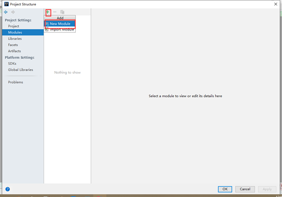
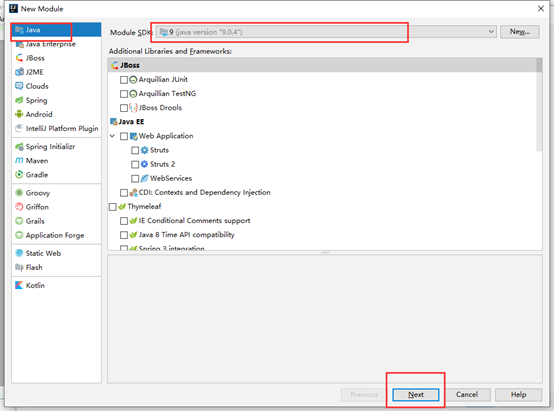
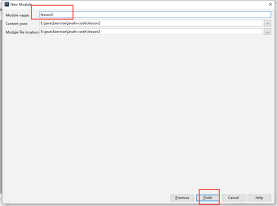
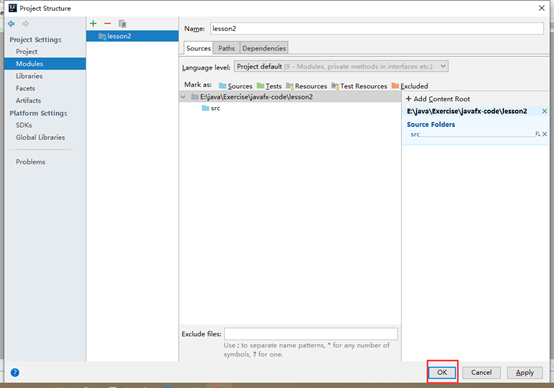
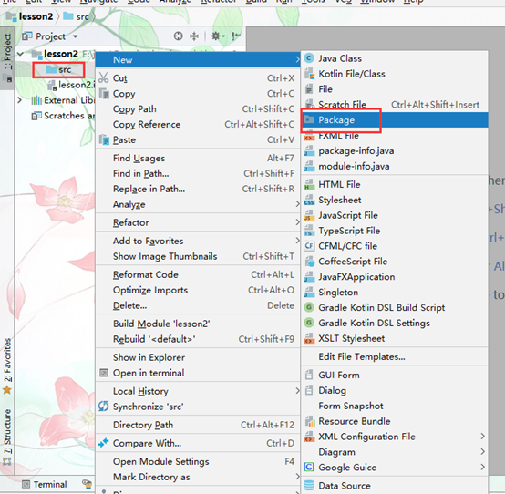
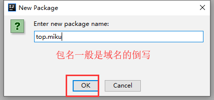
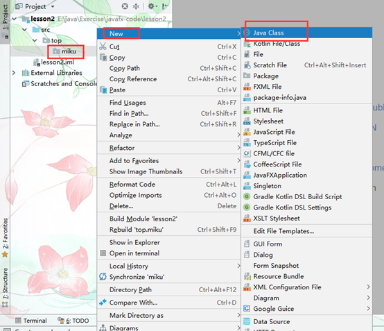

# IntelliJ IDEA

## 项目结构

Project【项目】>Module【模块】

一个项目中可以有多个模块。

## 下载

IntelliJ IDEA

https://www.jetbrains.com/idea/

## 使用步骤

直接新建Java项目是单个Module。

空项目加模块

从包里面建立代码文件。

​                               

 

 

 

 

 

 

 

## 快捷键

| 快捷键              | 功能                                                | 备注 |
| ------------------- | --------------------------------------------------- | ---- |
| alt+4               | 打开控制台                                          |      |
| Alt+Enter           | 自动修正代码                                        |      |
| ctrlt+Y             | 删除光标所在行                                      |      |
| Ctrl+D              | 复制光标所在行的内容，插入光标位置下面格式化代码    |      |
| ctrl+/              | 单行注释，再按取消注释                              |      |
| Ctrl+Shift+/        | 选中代码注释，多行注释，再按取消注释                |      |
| alt+ins             | 自动生成代码 toString，get，set等方法移动当前代码行 |      |
| Alt+Shift+上/下筋头 | 移动当前代码行                                      |      |