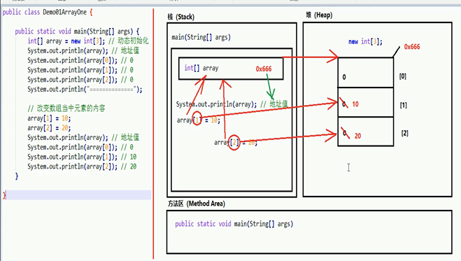
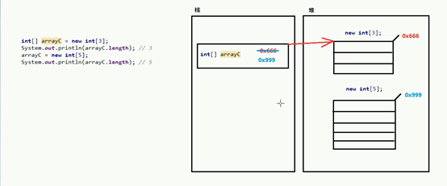

# 内存

## 划分

**栈（Stack）；**

存放的都是方法中的局部变量。**方法的运行一定要在栈当中运行。**

- 局部变量：方法的参数，或者是方法）内部的变量
- 作用域：一旦超出作用域，立刻从栈内存当中消失。

**堆（Heap）；**

**凡是new出来的东西，都在堆当中。**
堆内存里面的东西都有一个地址值：16进制堆内存里面的数据，都有默认值。规则：

- 如果是整数默认为0
- 如果是浮点数默认为0.0
- 如果是字符默认为\u0000’、
- 如果是布尔默认为false
- 如果是引用类型默认为null

**方法区（Method Area）；**

存储.class相关信息，包含方法的信息。

**本地方法栈（Native Method Stack）；**

与操作系统相关。

**寄存器（pc Register）；**

与CPU相关。

## 举例一个数组的内存变化

1. 程序执行先进栈。
2. 当执行到`new int[3]`  会在堆中开辟相应的内存。
3. 把`0x666`数组首地址给`array`变量，哪么这个变量自然存储的就是一个堆中的内存地址了。
4. 通过这个首地址就可以依次访问该单元的内容了。

> **开心一下；**
>
> 定义A数组，修改里面内容，然后把A数组的名字（其实这里是A数组的内存地址）赋值给B数组而不是重新（不new B）创建数组，这样B数组就可以访问A数组的内容或修改它的元素（B相当于拿到了一个二手的数组）。

## 数组

### 注意

- 数组的索引编号从呀开始，一直到"数组的长度-1为止。

- 如果访问数组元素的时候，索引编号并不存在，那么将会发生数组索引越界异常
  `ArrayIndexOutOfBoundsException`

  原因：索引编号写错了。
  解决：修改成为存在的正确索引编号。

- 所有的引用类型变量，都可以赋值为一个null值。但是代表其中什么都没有。

- 数组必须进行`new`初始化才能使用其中的元素。

- 如果只是赋值了一个null，没有进行new创建，那么将会发生：空指针异常`NullPointerException`

  原因：忘了new

  解决.补上new

从堆中创建的数组的长度永远是最初创建的那个固定长度的数组，如果要更改必须重新创建一个新的数组（new 新的），栈中的数组名一样可以，因为你创建的新的数组只是把这个数组的内存地址赋值给了原来的数组名。

